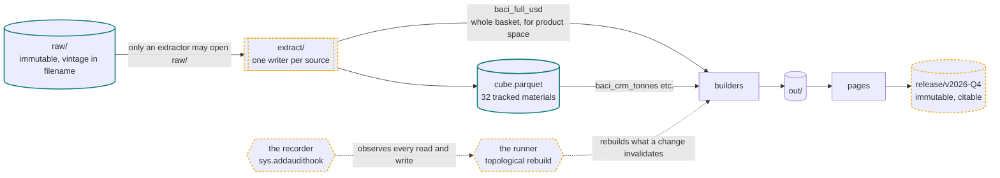
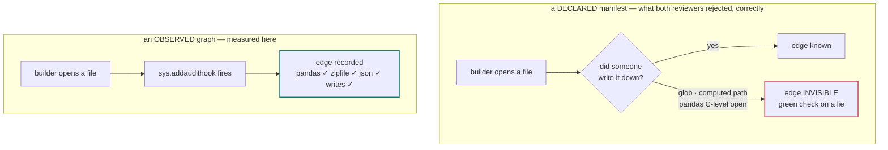
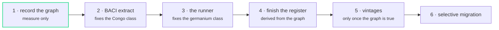

# Data architecture

How data moves through this project, what is enforced, and what is deliberately not built.

Written 7 Sep 2026 after two adversarial reviews; numbers re-measured 9 Sep from the recorded
graph. Every number here is observed, not estimated: `record_graph.py` runs each builder under
`sys.addaudithook` and writes what it actually opened to `out/graph.json`.

---

## 1. The system as it actually is

Not as it should be. An earlier draft of this document drew `raw → extract → cube → out → release`
and called the cube the spine. That diagram was aspiration. Measured:

| | |
|---|---|
| builders recorded / ran clean | 277 / 272 |
| builders that open `cube.parquet` | **7** |
| analysis families that read the cube | **0 of 13** |
| builders that open raw BACI archives themselves | **56** |
| ...that separately read the country-code file | **53** |
| builders that read another builder's `out/` | **107** (395 edges) |
| artifacts with more than one writer | **13** |
| raw datasets on disk / read by something | 35 / 29 |
| held datasets in the register / undocumented | 64 / 0 |
| published outputs carrying a version | **0** |

These replaced an earlier set taken from `grep`. Every one moved, and every one moved toward
worse: grep counted a builder that *mentions* `cube.parquet` as a reader, and `build_apparent.py`
mentions it without ever opening it. The seven that do open it are all infrastructure *for the
cube* - its catalog, dimension table, SDMX export, query manifest, source ledger. **No analysis
reads the cube.** It is a closed subsystem: built, validated, exported, and consumed by nothing
that produces a finding.

So the real shape is:

```
raw/  ──────────────┬──────────────────────────► builder ──► out/*.json ──┐
  (35 datasets)     │                             (71 of them)            │
                    │                                                     ├──► pages
                    └──► cube.parquet ──► its own catalog / SDMX / manifest│
                          (7 readers)     (0 analysis families)           │
                                                                          │
                    out/*.json ──────────────────────────────────────────►┘
                     (395 edges from 107 builders, builder to builder)
```

The cube is **a product with 7 readers and no analytical consumer**, not a hub. Drawing it as the spine is how this becomes a
platform nobody uses. It is the right home for the 32 tracked materials and the wrong home for a
country's whole export basket — and both statements stay true after this plan.

## 2. Two proven failures, one latent

**Proven — duplicated source logic.** A country-code correction (Republic of Congo filed under DR
Congo's ISO code) had to be applied in two places independently. There are 53 places it could have
been needed.

**Proven — stale derived copies.** `risk.json` served a retracted germanium score for three weeks
after `data.json` was corrected. A corrected source does not correct its copies.

**Latent — nothing published can be cited.** Every rebuild replaces the last, so a chart cannot name
the table behind it.

Work is ordered by proven harm, not by what is pleasant to build. The latent problem goes last.
This document originally put it first because it was small and felt like a win; that was the same
instinct that produces a tidy diagram of a system that does not exist.

## 3. The foundation: the graph is observed, not declared

Both reviewers independently said the dependency rules could not be enforced, because a
hand-written manifest always misses an edge — a glob, a path built from a variable, a `pandas`
call that opens a file in C rather than through Python.

That objection is correct about *declared* manifests and empirically wrong about this one.
`sys.addaudithook` sees every file access, including from compiled extensions. Tested here:

| access | seen by the hook |
|---|---|
| `pandas.read_parquet` | yes |
| `json.load(open(...))` | yes |
| `zipfile.ZipFile` | yes |
| writes (`out/library.json`, `DATA_LIBRARY.md`) | yes, exactly |

So the manifest is **recorded by running the builders**, not typed by hand. Nobody declares
anything; nobody can forget to. This is the same principle as everything else that worked in this
project: measure it, do not assert it.

And once the true graph exists, it can be **topologically sorted**, which turns the checks below
from a report into an action. A checker that says "stale" without rebuilding is, correctly, a guilt
dashboard: `check.py` would have been red for the germanium score for three weeks and the number
would still have been wrong.

## 4. Layers

```
raw/            immutable. Source bytes as published, vintage in the filename
                (BACI_HS02_V202601.zip). Never edited. Opened only by an extractor.

extract/        one writer per source. Normalized parquet: canonical ISO3, declared units,
                source vintage recorded. The only legal reader of raw/.

cube.parquet    the harmonized fact table for the 32 tracked materials. One consumer of
                extracts among several. Deliberately narrow.

out/            page and view models. Terminal by intent, and 395 edges from 107 builders
                currently violate that.
                The target is not "declare the 85 and move on" - a declared copy is still a
                copy, and germanium was an out/ -> out/ edge. The graph exists to shrink them.

release/        immutable published vintages. Cut, never edited.
```

Two rules about the cube, so it is not mistaken for a warehouse:

- Two compilations reporting the same (material, country, period) are **two observations, not a
  conflict**. `source` is a dimension. There is no precedence rule because none is wanted: the
  golden rule is that facts are never joined on `material` alone.
- Vocabularies for `measure`, `stage`, `basis`, `unit`, `obs_status` are declared as SDMX code
  lists in `build_sdmx.py` and validated against the data on every run.

## 5. Invariants

Enforced by `check.py`. Each is verified by deliberately breaking it — a guard nobody has seen
fail is not a guard.

| # | invariant | mechanism | status |
|---|---|---|---|
| I1 | only an extractor may open `raw/<source>/` | observed graph + a per-source allowlist | **needs the allowlist** |
| I2 | one writer per artifact | observed graph | **13 violations** - see below |
| I3 | every builder-to-builder edge is in the recorded graph | observed graph | recording first, enforcing later |
| I4 | an output whose inputs or producer changed is stale **and gets rebuilt** | content hashes + topological rebuild | not built |
| I5 | nothing reaches a public path without a licence decision | `licences.py`, injection-tested | **live** |
| I6 | a published page names the vintage it was built from | string check over `out/*.html` | not built |

On I1: it is global, and only one source (BACI) can be extracted first. Turning it on before the
other 28 are extracted would break the repository. So I1 ships **per source**, with an explicit
allowlist naming every source not yet migrated. The allowlist is the honest form of "we know, and
here is the list" — and it shrinks. A blanket rule that must be disabled is not a rule.

On I2: `grep` said zero double-writers. The graph found thirteen, in three kinds:

- **Eight are one defect.** `build_chain_trade.py` and a per-chain `extract_baci.py` both write
  `<chain>/out/<chain>_trade.json` - and they write *different content*. Tested on `wind-chain`:
  the committed file matches `build_chain_trade.py`, so the eight per-chain scripts are dead code
  that will silently win if they are ever run last. Whichever ran last wins, and nothing says so.
- **Three are post-processing by design.** `add_canonicals.py` rewrites pages after their builders;
  `build_cube.py` and `build_cube_usgs.py` share `source_anomalies.json`. These are ordering
  dependencies wearing the costume of a violation. The runner (phase 3) turns them into a
  declared order; until then they are the exact mechanism by which phase 1's first run degraded
  129 pages.
- **Two are unclear** (`record_magnet.py` vs `record_magnets.py`; `add_tonnes.py` vs
  `build_flows_fix.py`) and must be resolved by reading, not guessed at.

On I4: hashing is over the **inputs and the producer's code**, never the output, and never mtime.
`build_cube.py` currently derives `retrieved_at` from a file's modification time, which a fresh
clone resets — the same defect class as the drift check this project has already been bitten by.
That must move to content.

On I6: you cannot mechanically make a chart *mean* its citation, but you can refuse to publish a
page that does not contain the vintage string of the data it read. That is checkable and it is
the part that decays without a machine.

## 6. What is deliberately not built

- a warehouse or database service — there is no server, and there must not be one
- Airflow, Dagster, dbt. A topological rebuild over an observed graph is ~80 lines and needs no
  daemon, no scheduler, and no vendor.
- bronze/silver/gold naming
- a widened cube. Full BACI is ~5,000 HS6 codes in tonnes *and* USD; the cube holds 45 codes in
  tonnes. A full-BACI cube is order 20M rows — roughly 30x the current artefact — and would still
  not serve product space, whose method needs the entire export basket in value terms.
- migrating all 13 analysis families onto the cube. For most, reading raw is **correct**.

The failure mode at this scale is schema drift and licence amnesia, not missing infrastructure.

## 7. Sequence

Ordered by proven harm over cost.

**Phase 1 — record the graph. DONE 9 Sep.** `record_graph.py`, 272 of 277 builders recorded (the
five that fail are two scratch scripts, two social-post scripts wanting images that do not exist,
one genuinely broken). Three things it found that grep had not:

1. No analysis family reads the cube. Zero, not one.
2. Thirteen double-writers, eight of them one race between `build_chain_trade.py` and dead
   per-chain extractors.
3. **The repository has a build order that nothing encodes.** The recorder's first pass ran the
   builders alphabetically, which put `add_canonicals.py` first and let 200 page builders
   overwrite its work: 129 pages silently lost their canonical tags, favicons and clean URLs.
   Nothing errored and `check.py` stayed green. That is the strongest argument for phase 3 this
   document has, and it was found by accident.

The recorder now reverts every builder's writes before running the next, so observation leaves
no trace. It also refuses a `--only` that matches nothing, after a retry loop fed it names with
Windows line endings and reported success having recorded one builder out of 23.

**Phase 2 — the BACI extract.** One extractor writes `baci_crm_tonnes` (cube grain) and
`baci_full_usd` (whole basket). Migrate all 53 readers **in one sweep, not lazily** — lazy
migration keeps a proven bug class alive for months by choice. Then I1 for BACI only, with the
other 28 sources on the allowlist. The concentration finding is live and must reproduce exactly;
that test is written before the migration, not after.

**Phase 2 — status, 9 Sep.** Scoped from the recorded graph, not from grep:

- 56 readers. **39** unzip an archive (36 open HS17, 24 open HS02), **15** read only the
  country-code file, 2 only list the directory. So there are two accessors to serve, not one:
  `baci.year(y)` for the basket and `baci.countries()` for the lookup.
- **Two key systems in one repository.** The twenty chain extractors map BACI codes to ISO2 and
  carry a hand-written override dict (`490 -> TW`, `516 -> NA` - Namibia, whose ISO2 is the
  missing-value sentinel). The cube ingest maps to ISO3. All twenty override dicts are identical
  today, which is luck; `baci.FORCE` makes it design.
- **Two CRM code lists.** `out/crosswalk.json` (47 HS6, the cube's) is a strict superset of
  `concordance.tracked_hs6_set()` (31, the pipeline's). The extract filters on the superset.
- **Three things inference gets wrong**, found on the first member: HS codes need VARCHAR or
  `010121` becomes `10121`; in this vintage `q` is sometimes the empty string, not `NA`; and DuckDB
  creates its output before it fails, so a 0-byte parquet can exist and an accessor that tests
  existence will believe it. All three are handled in `extract_baci.py` and `baci.py`, and the
  extractor deletes its output on any failure rather than leave a second door.
- The acceptance harness (`phase2_accept.py`) is keyed per **(reader, output)**, not per output,
  because eight chain files have two writers producing different bytes. One hash per file would
  average the race away; the pair keeps it visible.

**Phase 2 — outcome, 9 Sep.** Applied in one sweep: 46 readers patched, 9 dead chain extractors
deleted, `baci.py` the only door, `check_baci_door` the ratchet (opens, not mentions). The
acceptance harness refused the first pass - 98 identical, 10 changed, 1 missing, 1 failing - and
every one of the twelve was run to ground rather than waved through:

- **Four were the nomenclature.** CEPII publishes every classification for every year since it
  began, so 2017-2024 exist in BOTH HS02 and HS17 and are different tables. The accessor had
  mapped year -> nomenclature and served HS17 to readers that had always read HS02; `build_avalidate`
  moved 37%. `baci.year(y, nom=...)` now takes the nomenclature as the READER'S choice; the
  extract holds both archives in full (31 members, 228M rows). All four are identical again.
- **Two were the originals' own nondeterminism** (`build_ot`: dict order from a set; 
  `build_network_sensitivity`: betweenness rank ties). Proven by running each original twice and the
  migrated version twice - the migrated-vs-migrated spread is the same size as original-vs-migrated.
  Accepted by name, and logged as defects in those builders.
- **Two moved with the data, by design**: the Comtrade cache refresh closed the 2021-2024 hole
  between baseline and compare, so `build_cube` and `build_catalog` changed. The BACI ingest was
  compared directly instead: all 23 years, 178,014 rows, identical sets, identical order - and
  20x faster (212 s -> 11 s).
- One was my import injector putting the import inside a docstring; one an unpatched archive
  loop in `build_chain_trade` (48 outputs, identical after the patch); one a harness ordering
  artefact in `add_canonicals`; one a script that was already broken.

Also found and fixed on the way: the shipped monthly layer was missing 2021-2024 because
`build.py` reads a cache only `refresh.py` fills, and I had run build directly - a build order
nothing encoded. It is encoded now: the cache carries a content fingerprint of its stores and
`build.py` refuses a cache that is behind them.

**Phase 3 — the runner.** Topological rebuild from the recorded graph, then I2, I3, I4. This is
what actually prevents another germanium.

**Phase 4 — finish the register.** `read_by`, `in_cube`, `last_refreshed` are **derived from the
graph**, not typed and not stored twice. The register answers *what do we hold*; the graph answers
*what feeds what*; `licences.py` answers *what may leave*. Three questions, three files, no
overlap. `check.py` fails on a `raw/` folder with no register row.

**Phase 5 — vintages.** Cut `release/v2026-Q4` once the graph is true, and only then. A frozen bag
of undeclared edges is not a vintage; `BACI V202601` means *these source bytes plus this method*,
and until Phase 3 we cannot say either. Releases attach to GitHub Releases / Zenodo rather than
living in git, so cadence is a publishing decision and not a repository-size one.

**Phase 6 — selective cube migration.** Only where the cube serves better than raw.

## 8. Risks

1. **A green gate on a lie.** Mitigated more by observation than by policy: an undeclared read is
   the thing you cannot detect, so we stopped asking people to declare. Residual risk is a builder
   that is never run under the hook — so the recorder runs over *all* builders, and a builder with
   no recorded graph is itself a failure.
2. **A fake platform.** Rules bypassed because they are slower than not using them. The correct
   path must be shorter: `baci.load()` must be less typing than opening a zip. If it is not, it
   loses, and it deserves to.
3. **Phase 2 changes a published finding.** The concentration result is live. Exact reproduction is
   the acceptance test, written first.
4. **The plan is drawn for a system that does not exist.** After all six phases, most families still
   read `extract → builder → out`. That is fine and intended. This document should be re-measured,
   not re-remembered — the table in §1 is regenerated, and if it stops matching the prose, the
   prose is wrong.

---

## 9. The schema, drawn

### 9.1 Today

Every edge below was measured. The cube is a product with 11 readers, not a hub, and the diagram
says so.

```mermaid
flowchart LR
  RAW[("raw/<br>35 datasets · 3.7 GB")]
  ZIP{{"raw/baci/*.zip"}}
  CUBE[("cube.parquet<br>671,582 rows")]
  B78["71 builders"]
  B1["0 families<br>(only the cube&#39;s own catalog / export)"]
  OUT[("out/<br>107 JSON")]
  PAGES["355 pages"]

  RAW --> ZIP
  ZIP -->|"56 builders open the zips<br>53 read the country-code file themselves"| B78
  RAW --> CUBE
  RAW --> B78
  CUBE -->|"7 readers"| B1
  B78 --> OUT
  B1 --> OUT
  OUT -->|"395 builder-to-builder edges<br>germanium was one of these"| OUT
  OUT --> PAGES

  classDef bad stroke:#d94a5f,stroke-width:2px
  classDef ok stroke:#0e7c74,stroke-width:2px
  class ZIP,OUT bad
  class CUBE ok
```



The two red boxes are the two proven failures. `raw/baci/*.zip` is opened 56 times with 53 copies
of the same country-code logic — that is the Congo bug's surface. The `out/ → out/` self-loop is
the germanium incident: a copy that nothing rebuilt.

### 9.2 After the plan

Note what does **not** change: most families still go `extract → builder → out`. The cube does not
become the spine, because it should not be. What changes is that every edge is *known*, every raw
open goes through one door per source, and a changed input rebuilds what depends on it.



Yellow dashed = does not exist yet. The recorder and the runner are the same object seen twice:
the recorder learns the graph by watching builders run, and the runner uses that graph to rebuild
in dependency order. Neither requires a daemon, a scheduler, or a vendor.

### 9.3 Why the recorder can work where a manifest cannot



Nobody declares anything, so nobody can forget to. This is why the invariants in §5 are
enforceable rather than aspirational.

### 9.4 Order of work

Sequenced by proven harm over cost. Phase 1 is pure measurement and cannot break anything.



The first draft of this document had **5** first, because it was small and felt like a product win.
Freezing a citable release before the graph is true would publish a bag of undeclared edges and
call it discipline.
